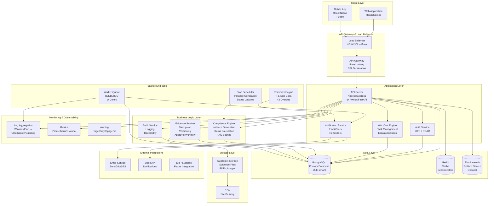

# Compliance OS V1 - System Architecture

## 🏗️ Architecture Overview

Compliance OS V1 is designed as a **multi-tenant SaaS application** with a modern microservices-inspired architecture, optimized for audit-readiness, performance, and scalability.

---

## 📐 System Architecture Diagram



---

## 🧩 Component Responsibilities

### **1. Client Layer**

#### **Web Application (React/Next.js)**
**Responsibility**: User-facing interface for all personas
- **Dashboards**: Executive Control Tower, Compliance Calendar, Owner View
- **Compliance Management**: Create/edit compliance instances, update status
- **Workflow**: Task assignment, approvals, comments
- **Evidence Vault**: File upload, view, approve/reject
- **Reports**: RAG status, audit reports
- **Authentication**: Login, session management

**Tech Stack**: React, Next.js, TypeScript, TailwindCSS, React Query

**Why Next.js?** Server-side rendering for faster initial loads, built-in API routes, excellent SEO (for documentation pages).

---

### **2. API Gateway & Load Balancer**

#### **Load Balancer (NGINX/Cloudflare)**
**Responsibility**: Traffic distribution and DDoS protection
- Distribute requests across multiple API servers
- SSL/TLS termination
- Rate limiting per tenant
- Geographic routing (India data residency)

#### **API Gateway**
**Responsibility**: Request routing and middleware
- Route requests to appropriate services
- Authentication validation (JWT verification)
- Request logging
- CORS handling
- API versioning (`/v1/`, `/v2/`)

---

### **3. Application Layer**

#### **API Server (Node.js/Express or Python/FastAPI)**
**Responsibility**: Core REST API endpoints
- **Tenant Management**: CRUD operations for tenants
- **Entity Management**: CRUD for legal entities
- **Compliance CRUD**: Create/read/update compliance masters and instances
- **Workflow Endpoints**: Task creation, assignment, status updates
- **Evidence Endpoints**: Upload, download, approval
- **Dashboard Data**: Aggregate queries for RAG status, overdue items
- **Search**: Full-text search across compliance names, entities

**Tech Stack Options**:
- **Node.js/Express**: Fast development, JavaScript ecosystem
- **Python/FastAPI**: Strong data processing, great for compliance rule engines

**Key Features**:
- Multi-tenant request isolation (always filter by `tenant_id`)
- Input validation (Joi/Zod)
- Error handling middleware
- Request/response logging

---

#### **Auth Service**
**Responsibility**: Authentication and authorization
- **JWT Token Generation**: Issue tokens on login
- **Role-Based Access Control (RBAC)**: Check user permissions
- **Entity-Level Access**: Verify user can access specific entity
- **Session Management**: Token refresh, logout
- **Password Hashing**: bcrypt/argon2

**Security Considerations**:
- JWT tokens include `tenant_id`, `user_id`, `roles[]`
- Tokens expire after 24 hours (refresh token for 7 days)
- Rate limit login attempts (prevent brute force)

---

#### **Workflow Engine**
**Responsibility**: Task lifecycle management
- **Task Creation**: Generate tasks from compliance instances
- **Assignment Logic**: Assign to users or roles
- **Status Transitions**: Enforce workflow rules (Pending → In Progress → Completed)
- **Escalation Rules**: 
  - T-3 days → Notify owner
  - Due date → Notify approver
  - +3 days overdue → Escalate to CFO
- **Dependency Checking**: Block tasks if dependencies unmet

**Example Flow**:
```
Compliance Instance Created
  → Generate "Prepare" task → Assign to Tax Lead
  → On completion → Generate "Review" task → Assign to CFO
  → On approval → Generate "File" task → Assign to Tax Lead
```

---

#### **Notification Service**
**Responsibility**: Multi-channel notifications
- **Email Notifications**: 
  - Daily digest of overdue items
  - Task assignments
  - Approval requests
  - Escalation alerts
- **Slack Integration**: Real-time alerts for critical items
- **In-App Notifications**: Store in database for notification center

**Templates**:
- Task assigned: "You have been assigned: [Task Name]"
- Overdue alert: "[Compliance Name] is overdue by [X] days"
- Approval needed: "[User] requested approval for [Compliance]"

---

### **4. Business Logic Layer**

#### **Compliance Engine**
**Responsibility**: Core compliance logic
- **Instance Generation**: 
  - Cron job runs monthly/quarterly
  - Reads `compliance_masters` with frequency rules
  - Generates `compliance_instances` for each applicable entity
  - Calculates `due_date` from `due_date_rule` JSONB
- **Status Calculation**:
  - Rules engine evaluates status:
    - If `due_date < today` AND `status != Completed` → `Overdue`
    - If dependency unmet → `Blocked`
    - If all tasks completed → `Completed`
- **RAG Scoring**:
  - **Green**: On track (due date > 7 days away, no blockers)
  - **Amber**: At risk (due date < 7 days, or dependencies pending)
  - **Red**: Overdue or critical blocker

**Example Rule**:
```javascript
if (dueDate < today && status !== 'Completed') {
  status = 'Overdue';
  ragStatus = 'Red';
}
```

---

#### **Evidence Service**
**Responsibility**: File management and audit trail
- **File Upload**:
  - Accept PDF, images, documents
  - Generate SHA-256 hash for integrity
  - Store in S3/Object Storage
  - Create `evidence` record in database
- **Versioning**:
  - When evidence updated, create new row with `version++`
  - Link via `parent_evidence_id`
  - Old versions remain immutable
- **Approval Workflow**:
  - Upload → `approval_status = 'Pending'`
  - Approver reviews → `approval_status = 'Approved'` or `'Rejected'`
  - Once approved → `is_immutable = true` (cannot delete)
- **File Retrieval**:
  - Generate signed URLs for secure download
  - CDN for fast delivery

**Security**:
- File size limits (e.g., 10MB per file)
- Virus scanning (optional, via ClamAV)
- Access control: Only users with entity access can view evidence

---

#### **Audit Service**
**Responsibility**: Immutable audit trail
- **Log All Actions**:
  - CREATE, UPDATE, DELETE on critical tables
  - APPROVE, REJECT actions
  - Login/logout events
- **Capture Context**:
  - User ID, tenant ID, IP address
  - Before/after values (JSONB snapshots)
  - Timestamp (UTC)
- **Query Interface**:
  - "Show all changes to compliance_instance X"
  - "Show all actions by user Y in last 30 days"
  - "Audit report for entity Z for FY2024"

**Design Principle**: Append-only. Never update or delete audit logs.

---

### **5. Data Layer**

#### **PostgreSQL (Primary Database)**
**Responsibility**: Relational data storage
- All structured data (tenants, entities, compliance, tasks, evidence metadata)
- ACID transactions for data integrity
- Multi-tenant isolation via `tenant_id` filtering
- Full-text search via `pg_trgm` extension
- JSONB for flexible fields (`due_date_rule`, `metadata`)

**Connection Pooling**: Use PgBouncer or connection pooler to manage connections efficiently.

**Backup Strategy**:
- Daily automated backups
- Point-in-time recovery (PITR)
- Encrypted backups

---

#### **Redis (Cache & Session Store)**
**Responsibility**: Performance optimization
- **Session Storage**: JWT refresh tokens
- **Cache Layer**:
  - Dashboard queries (RAG status, overdue count)
  - Compliance master lookups
  - Entity access permissions
- **Rate Limiting**: Track API call counts per tenant
- **Task Queue**: Bull/BullMQ for background jobs

**Cache Strategy**:
- TTL: 5 minutes for dashboard data, 1 hour for static data
- Invalidate on updates (e.g., compliance status change)

---

#### **Elasticsearch (Optional - Full-Text Search)**
**Responsibility**: Advanced search capabilities
- Search across compliance names, descriptions
- Search evidence file names, metadata
- Faceted search (by category, status, entity)

**When to Use**: If PostgreSQL `pg_trgm` search is too slow for large datasets.

---

### **6. Storage Layer**

#### **S3/Object Storage (AWS S3, MinIO, or Backblaze)**
**Responsibility**: Evidence file storage
- Store uploaded files (PDFs, images, documents)
- Versioning enabled (for evidence versioning)
- Lifecycle policies: Move old files to Glacier after 7 years
- Encryption at rest (AES-256)

**File Organization**:
```
s3://compliance-os-evidence/
  {tenant_id}/
    {entity_id}/
      {compliance_instance_id}/
        {evidence_id}_{version}.pdf
```

---

#### **CDN (CloudFront, Cloudflare)**
**Responsibility**: Fast file delivery
- Cache evidence files at edge locations
- Reduce latency for global users
- Signed URLs for secure access

---

### **7. Background Jobs**

#### **Worker Queue (Bull/BullMQ or Celery)**
**Responsibility**: Asynchronous task processing
- **Email Sending**: Queue emails to avoid blocking API
- **File Processing**: Generate thumbnails, extract metadata
- **Report Generation**: Generate PDF reports asynchronously
- **Bulk Operations**: Import compliance masters, bulk status updates

**Why Queue?** Prevents API timeouts on long-running operations.

---

#### **Cron Scheduler**
**Responsibility**: Scheduled tasks
- **Daily**: Generate compliance instances (check for monthly/quarterly due)
- **Hourly**: Recalculate RAG status for all instances
- **Daily**: Update overdue status
- **Weekly**: Generate compliance calendar for next week

**Implementation**: 
- Node.js: `node-cron` or external scheduler (AWS EventBridge)
- Python: Celery Beat

---

#### **Reminder Engine**
**Responsibility**: Proactive notifications
- **T-3 Days**: Check instances due in 3 days → Notify owner
- **Due Date**: Check instances due today → Notify approver
- **+3 Overdue**: Check instances overdue by 3+ days → Escalate to CFO

**Logic**:
```javascript
// Run every hour
const instances = getInstancesDueInDays(3);
instances.forEach(instance => {
  notify(instance.owner_user_id, `Due in 3 days: ${instance.compliance_name}`);
});
```

---

### **8. External Integrations**

#### **Email Service (SendGrid/SES)**
**Responsibility**: Transactional emails
- Task assignments
- Approval requests
- Overdue alerts
- Daily/weekly digests

**Templates**: Use template engine (Handlebars, MJML) for branded emails.

---

#### **Slack API**
**Responsibility**: Real-time team notifications
- Critical alerts (overdue items)
- Approval requests
- Team updates

**Setup**: Slack App with webhook or Bot Token.

---

#### **ERP Systems (Future)**
**Responsibility**: Data integration
- Pull financial data for FP&A compliance
- Sync entity information
- Trigger compliance instances based on ERP events

**V1**: Out of scope, but architecture supports future integration.

---

### **9. Monitoring & Observability**

#### **Log Aggregation (Winston/Pino → CloudWatch/Datadog)**
**Responsibility**: Centralized logging
- Application logs (API requests, errors)
- Audit logs (already in PostgreSQL, but also stream to log service)
- Worker logs

**Log Levels**: ERROR, WARN, INFO, DEBUG

---

#### **Metrics (Prometheus/Grafana)**
**Responsibility**: Performance monitoring
- API response times
- Database query performance
- Cache hit rates
- Active users per tenant
- Compliance completion rates

**Key Metrics**:
- `api_request_duration_seconds`
- `compliance_instances_overdue_total`
- `evidence_uploads_total`

---

#### **Alerting (PagerDuty/Opsgenie)**
**Responsibility**: Incident response
- Database connection failures
- High error rates (>5% of requests)
- Disk space warnings
- S3 upload failures

---

## 🔄 Request Flow Examples

### **Example 1: User Views Dashboard**
```
1. User → Web App → API Gateway
2. API Gateway validates JWT → Extracts tenant_id
3. API Server → Auth Service: Verify user has access
4. API Server → Redis: Check cache for dashboard data
5. Cache miss → API Server → PostgreSQL: Query compliance_instances
6. Calculate RAG status, aggregate counts
7. Store in Redis cache (TTL: 5 min)
8. Return JSON → Web App renders dashboard
```

### **Example 2: Upload Evidence**
```
1. User selects file → Web App → API Server
2. API Server → Auth Service: Verify entity access
3. API Server → Evidence Service: Validate file (size, type)
4. Evidence Service → S3: Upload file, get URL
5. Evidence Service → PostgreSQL: Insert evidence record
6. Evidence Service → Audit Service: Log CREATE action
7. Evidence Service → Notification Service: Notify approver
8. Notification Service → Email Service: Send approval request
9. Return success → Web App shows confirmation
```

### **Example 3: Compliance Instance Generation (Background)**
```
1. Cron Scheduler triggers daily job
2. Worker → Compliance Engine: Get all active compliance_masters
3. For each master with frequency = "Monthly":
   - Check if instance already exists for current period
   - If not, generate compliance_instance for each applicable entity
   - Calculate due_date from due_date_rule
   - Set status = "Not Started"
4. Compliance Engine → PostgreSQL: Bulk insert instances
5. Compliance Engine → Workflow Engine: Generate initial tasks
6. Workflow Engine → Notification Service: Notify owners
```

---

## 🎯 Architecture Principles

### **1. Multi-Tenancy**
- **Data Isolation**: Every query filters by `tenant_id`
- **Application-Level**: Enforced in application code (not database RLS in V1)
- **Performance**: Denormalize `tenant_id` where needed to avoid joins

### **2. Audit-Ready**
- **Immutable Logs**: Audit logs never updated/deleted
- **Evidence Immutability**: Approved evidence cannot be deleted
- **Full Traceability**: Every action logged with user, timestamp, before/after

### **3. Performance**
- **Caching**: Redis for frequently accessed data
- **Indexes**: Strategic indexes on common query patterns
- **CDN**: Fast file delivery
- **Async Processing**: Background jobs for heavy operations

### **4. Scalability**
- **Horizontal Scaling**: Stateless API servers, add more as needed
- **Database**: Read replicas for reporting queries
- **Storage**: S3 scales automatically

### **5. Security**
- **Encryption**: At rest (database, S3) and in transit (TLS)
- **Authentication**: JWT with refresh tokens
- **Authorization**: RBAC + entity-level access control
- **Input Validation**: All inputs validated and sanitized

---

## 🚀 Deployment Architecture

### **Recommended Stack (V1)**

**Option A: Node.js Stack**
- **Frontend**: Next.js (Vercel or self-hosted)
- **Backend**: Node.js + Express (AWS ECS/Fargate or Railway)
- **Database**: PostgreSQL (AWS RDS or Supabase)
- **Cache**: Redis (AWS ElastiCache or Upstash)
- **Storage**: AWS S3 or Backblaze B2
- **Queue**: BullMQ with Redis
- **Monitoring**: Datadog or New Relic

**Option B: Python Stack**
- **Frontend**: Next.js (same as above)
- **Backend**: Python + FastAPI (AWS ECS/Fargate)
- **Database**: PostgreSQL (same)
- **Cache**: Redis (same)
- **Storage**: S3 (same)
- **Queue**: Celery with Redis
- **Monitoring**: Same

### **India Data Residency**
- Deploy database and storage in Mumbai region (AWS ap-south-1)
- Ensure all data stays within India borders
- Use Indian payment gateways if needed

---

## 📊 Scalability Considerations

### **V1 Capacity Targets**
- **Tenants**: 10-50 tenants
- **Users per Tenant**: 5-50 users
- **Compliance Instances**: ~1000 per tenant
- **API Requests**: 1000 requests/minute
- **File Storage**: 100GB per tenant

### **Future Scaling (Post-V1)**
- **Database Sharding**: Shard by tenant_id for 1000+ tenants
- **Read Replicas**: Separate read replicas for reporting
- **Microservices**: Split into separate services (compliance-service, workflow-service, evidence-service)
- **Event-Driven**: Use message queue (RabbitMQ, Kafka) for service communication

---

## 🎓 Learning Notes

### **Why Microservices-Inspired but Monolithic in V1?**
- **V1 Goal**: Ship fast, validate product-market fit
- **Monolithic Benefits**: Easier debugging, simpler deployment, lower operational overhead
- **Microservices Later**: When you need independent scaling (e.g., evidence service needs more resources)

### **Why Redis for Caching?**
- **Fast**: In-memory, sub-millisecond reads
- **Flexible**: Can store strings, hashes, lists, sets
- **Pub/Sub**: Useful for real-time notifications
- **Queue Support**: BullMQ uses Redis for job queues

### **Why S3 for File Storage?**
- **Scalability**: Handles millions of files automatically
- **Durability**: 99.999999999% (11 nines!)
- **Cost**: Pay only for what you use
- **CDN Integration**: Easy to add CloudFront for fast delivery

---

## ✅ Architecture Checklist

- [x] Multi-tenant isolation
- [x] Authentication & authorization
- [x] Audit trail (immutable logs)
- [x] Evidence storage (immutable after approval)
- [x] Background jobs for async processing
- [x] Notification system (email + Slack)
- [x] Caching layer for performance
- [x] Monitoring & observability
- [x] Scalability considerations
- [x] Security (encryption, access control)
- [x] India data residency ready

---

**Remember**: "If it cannot stand up to an auditor, it does not ship." This architecture ensures audit-readiness at every layer! 🎯

